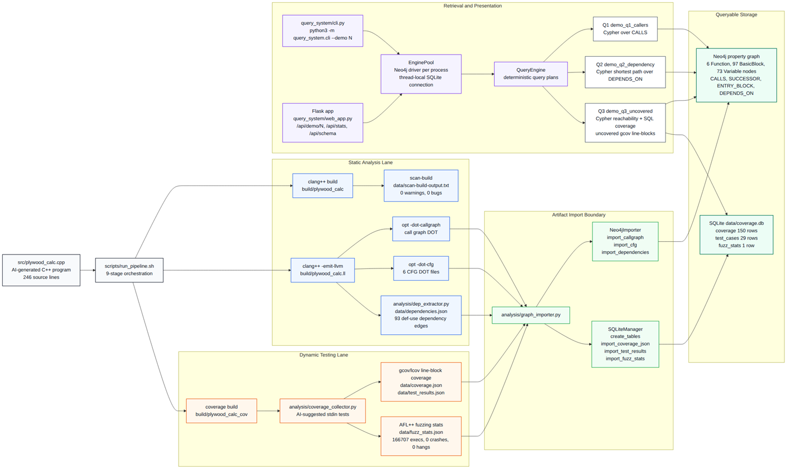

# Plywood Analyzer
Static graph analysis and dynamic execution evidence for a C++ plywood cut calculator.

Plywood Analyzer turns `src/plywood_calc.cpp` into queryable program-analysis evidence. The pipeline extracts a call graph, per-function control-flow graphs, source-level variable dependencies, gcov line-block coverage, differential test results, fuzzing statistics, and static-analyzer output. Neo4j stores the graph-shaped facts that need traversal, while SQLite stores measured execution facts that need grouping, filtering, and stable replay; Q3 joins both stores at query time.

## Architecture
The system has a five-pillar pipeline: compile the C++ target, emit LLVM analysis artifacts, extract dependency facts, collect dynamic evidence, and import the results into two query stores. Neo4j holds `Function`, `BasicBlock`, and `Variable` nodes plus traversal edges; SQLite holds coverage, tests, and fuzz statistics. `query_system.query_engine.QueryEngine` combines both stores for CLI calls and Flask routes, so graph reachability and measured coverage stay separate until a question needs both.



*Figure 1: Existing repository diagram for the five-pillar pipeline that produces Neo4j and SQLite stores joined by the query layer.*

## Quick Start
```bash
bash scripts/run_pipeline.sh
bash scripts/demo_smoke_test.sh
python3 -m query_system.cli --demo 1 --func main
python3 -m query_system.cli --demo 2 \
  --var-a vis_height \
  --var-b grid \
  --var-a-func render_visualization \
  --var-b-func render_visualization
python3 -m query_system.cli --demo 3
WEB_HOST=127.0.0.1 WEB_PORT=5000 \
  python3 -m query_system.web_app
```

## Supported Queries

### Q1 - Function Call Neighborhood
Question: "Where is function `main` called, and which functions does it call?"

Cypher excerpt:
```cypher
MATCH (caller:Function)-[:CALLS]->
      (t:Function {name: $fname})
RETURN caller.name AS caller_function
ORDER BY caller.name;

MATCH (t:Function {name: $fname})-[:CALLS]->
      (callee:Function)
RETURN callee.name AS callee_function
ORDER BY callee.name;
```

CLI invocation:
```bash
python3 -m query_system.cli --demo 1 --func main
```

HTTP equivalent:
```bash
curl -fsS 'http://127.0.0.1:5000/api/demo/1?func=main'
```

Expected JSON shape:
```json
{
  "type": "call_graph",
  "function": "main",
  "callers": [],
  "callees": ["calculate_cuts", "get_input", "print_result"]
}
```

What it tells a developer: Q1 gives a local call-graph slice for one function. For `main`, the live graph shows no callers and five callees: `calculate_cuts`, `get_input`, `print_result`, `render_visualization`, and `validate_dimensions`. That makes `main` the orchestration point and shows where a behavior change can fan out.

### Q2 - Variable Dependency Path
Question: "Are `vis_height` and `grid` dependent inside `render_visualization`?"

Cypher excerpt:
```cypher
MATCH (a:Variable {name: $va}),
      (b:Variable {name: $vb})
WHERE ($vaf IS NULL OR a.function IN $vaf)
  AND ($vbf IS NULL OR b.function IN $vbf)
MATCH p = shortestPath(
  (a)-[:DEPENDS_ON*1..10]-(b)
)
RETURN [n IN nodes(p) | n.name] AS path,
       [n IN nodes(p) | n.function] AS functions,
       length(p) AS depth
ORDER BY depth
LIMIT 5;
```

CLI invocation:
```bash
python3 -m query_system.cli --demo 2 \
  --var-a vis_height \
  --var-b grid \
  --var-a-func render_visualization \
  --var-b-func render_visualization
```

HTTP equivalent:
```bash
curl -fsS 'http://127.0.0.1:5000/api/demo/2?var_a=vis_height&var_b=grid&var_a_func=render_visualization&var_b_func=render_visualization'
```

Expected JSON shape:
```json
{
  "type": "dependency",
  "dependent": true,
  "paths": [
    {"nodes": ["vis_height", "grid"], "depth": 1}
  ]
}
```

What it tells a developer: Q2 checks whether two scoped variables sit on the same dependency path. The live result reports a depth-1 path from `vis_height` to `grid`, which means the visualization grid dimensions depend directly on the computed display height in `render_visualization`.

### Q3 - Reachable Functions With Uncovered Line-Blocks
Question: "Which functions reachable from `main` contain uncovered gcov line-blocks?"

Cypher excerpt:
```cypher
MATCH (m:Function {name: 'main'})
      -[:CALLS*0..10]->(f:Function)
RETURN DISTINCT f.name AS fname
ORDER BY f.name;
```

SQL excerpt:
```sql
WITH effective AS (
    SELECT block_id, MAX(hit_count) AS hit_count
    FROM coverage
    WHERE function = ?
    GROUP BY block_id
)
SELECT COUNT(*) AS total,
       SUM(CASE WHEN hit_count = 0 THEN 1 ELSE 0 END) AS uncovered,
       GROUP_CONCAT(CASE WHEN hit_count = 0 THEN block_id END) AS uncov_blocks
FROM effective;
```

CLI invocation:
```bash
python3 -m query_system.cli --demo 3
```

HTTP equivalent:
```bash
curl -fsS 'http://127.0.0.1:5000/api/demo/3'
```

Expected JSON shape:
```json
{
  "type": "coverage_reachability",
  "reachable_functions": ["calculate_cuts", "get_input", "main"],
  "uncovered_functions": [
    {
      "function": "render_visualization",
      "uncovered_blocks": 2,
      "total_blocks": 59,
      "coverage_pct": 96.6
    }
  ]
}
```

What it tells a developer: Q3 performs a cross-store join: Cypher finds functions reachable from `main`, then a SQLite coverage CTE computes effective block hits for each reachable function. The live result isolates `render_visualization`, with two uncovered line-blocks out of 59. In the web UI, `View source highlights` opens the source panel and requests `/api/source/highlights?kind=uncovered` to mark those lines.

## HTTP API
| GET path | What it returns | One-line description |
|---|---|---|
| `/api/health` | JSON liveness status | Checks that Flask can answer and reports Neo4j ping state. |
| `/api/ready` | JSON readiness status plus HTTP 200 or 503 | Checks Neo4j and SQLite before a demo starts. |
| `/api/stats` | JSON aggregate stats | Returns function count, graph node and edge counts, coverage percent, test count, and scan-build status. |
| `/api/schema` | Plain-text SQLite DDL | Returns `analysis.graph_importer.SCHEMA_DDL`. |
| `/api/source` | JSON source file payload | Returns `src/plywood_calc.cpp` as `path`, `lines`, and `source`. |
| `/api/source/highlights` | JSON highlight rows | Returns uncovered source line highlights for `kind=uncovered`. |
| `/api/options/functions` | JSON function-name list | Reads function options from Neo4j, with SQLite fallback. |
| `/api/options/variables` | JSON variable-name list | Reads variables scoped by the `function` query parameter. |
| `/api/evidence/neo4j` | JSON graph counts and samples | Returns label counts, relationship counts, call samples, and dependency samples. |
| `/api/evidence/sqlite` | JSON SQLite rollups | Returns table counts, coverage rollups, test pass rate, and fuzz rows. |
| `/api/evidence/coverage/uncovered` | JSON uncovered coverage rows | Lists effective coverage rows with `hit_count = 0`. |
| `/api/evidence/coverage/delta` | JSON baseline/replay comparison | Compares `gcov_curated` rows with AFL replay coverage rows. |
| `/api/demo/1` | JSON Q1 answer | Runs `QueryEngine.demo_q1_callers`. |
| `/api/demo/2` | JSON Q2 answer | Runs `QueryEngine.demo_q2_dependency`. |
| `/api/demo/3` | JSON Q3 answer | Runs `QueryEngine.demo_q3_uncovered`. |

## Storage Schema

### Neo4j (property graph)
- `(:Function {name})` represents one user-defined C++ function imported from `build/plywood_calc.ll.callgraph.dot`.
- `(:BasicBlock {id, function, label, instructions, line_count})` represents one CFG basic block imported from `build/cfg/*.dot`.
- `(:Variable {name, function})` represents one source-level variable scoped by function.
- `(:Function)-[:CALLS]->(:Function)` records call-graph edges; it has no properties.
- `(:Function)-[:ENTRY_BLOCK]->(:BasicBlock)` links a function to its first CFG block.
- `(:BasicBlock)-[:SUCCESSOR {condition}]->(:BasicBlock)` records CFG successor edges and branch labels.
- `(:Variable)-[:DEPENDS_ON {type, callee}]->(:Variable)` records data-flow and cross-call dependency edges from `data/dependencies.json`.
- Live graph counts: 6 `Function`, 97 `BasicBlock`, 76 `Variable`, 6 `CALLS`, 6 `ENTRY_BLOCK`, 56 `SUCCESSOR`, and 117 `DEPENDS_ON`.

### SQLite (data/coverage.db)
- `coverage` has `function`, `block_id`, `line_start`, `line_end`, `hit_count`, `branch_taken`, and `source`; its primary key is `(block_id, source)`.
- `test_cases` has `name`, `source`, `board_l`, `board_w`, `cut_l`, `cut_w`, `expected_pieces`, `actual_pieces`, `passed`, and `created_at`; its primary key is `(name, source)`.
- `fuzz_stats` has `source`, `total_execs`, `execs_per_sec`, `unique_crashes`, `unique_hangs`, `paths_total`, `paths_found`, `corpus_count`, `run_time_seconds`, `afl_replay_count`, `afl_replay_blocks_added`, and `recorded_at`.
- Live row counts: 150 `coverage`, 29 `test_cases`, and 1 `fuzz_stats`.
- `coverage.source` records the producer. The current database contains `gcov_curated`; replay imports use `gcov_afl_replay`.
- Every coverage reader uses an effective-MAX CTE so replay rows can add hits without deleting curated rows.

```sql
WITH effective AS (
  SELECT function, block_id, MAX(hit_count) AS hit_count
  FROM coverage
  GROUP BY function, block_id
)
SELECT function, block_id, hit_count
FROM effective;
```

## Pipeline
`scripts/run_pipeline.sh` is the reproducible build-and-import path. It prefers versioned LLVM tools (`clang-14`, `clang++-14`, `opt-14`, `scan-build-14`) and writes artifacts under `build/` and `data/` before loading Neo4j and SQLite.

1. Compile: `src/plywood_calc.cpp` and `CMakeLists.txt` -> `build/plywood_calc`, `build/plywood_calc_cov`.
2. Emit LLVM IR: `src/plywood_calc.cpp` -> `build/plywood_calc.ll`.
3. Callgraph DOT: `build/plywood_calc.ll` -> `build/plywood_calc.ll.callgraph.dot`.
4. CFG DOT: `build/plywood_calc.ll` -> `build/cfg/*.dot`.
5. `dep_extractor`: `build/plywood_calc.ll` -> `data/dependencies.json`.
6. `scan-build`: `src/plywood_calc.cpp` -> `data/scan-build-output.txt`.
7. Test + gcov: `build/plywood_calc_cov` and `tests/*.txt` -> `data/coverage.json`, `data/test_results.json`.
8. AFL queue replay: `fuzzing/findings/default/queue/id:*` and `build/plywood_calc_cov` -> `data/coverage_replay.json`, `data/fuzz_stats.json`.
9. Import to Neo4j + SQLite: DOT and JSON artifacts -> Neo4j graph plus `data/coverage.db`.

## Configuration
| Variable | Default | Purpose |
|---|---|---|
| `NEO4J_URI` | `bolt://localhost:7687` | Bolt endpoint used by the importer, CLI, and Flask app. |
| `NEO4J_USER` | `neo4j` | Neo4j username. |
| `NEO4J_PASSWORD` | `plywood2026` | Neo4j password from `docker-compose.yml`. |
| `SQLITE_DB` | `data/coverage.db` | SQLite database path. |
| `ANTHROPIC_API_KEY` | unset | Optional key for natural-language query translation. |
| `LOG_LEVEL` | `INFO` | Python logging level for Flask and services. |
| `WEB_HOST` | `0.0.0.0` | Flask bind host. |
| `WEB_PORT` | `5000` | Flask bind port. |
| `STATS_CACHE_TTL` | `10` | Seconds to cache `/api/stats` and evidence summaries. |
| `SOURCE_CACHE_TTL` | `60` | Seconds to cache source-file reads. |
| `NL_QUESTION_MAX_LEN` | `500` | Maximum accepted natural-language question length. |
| `CORS_ORIGINS` | `*` | CORS origins for `/api/*`. |

## Development Setup

### Dependencies
- `clang-14`, `clang++-14`, and `opt-14` for LLVM IR and DOT extraction.
- `scan-build-14` for Clang Static Analyzer output.
- Python 3.10+ with packages from `requirements.txt`.
- Docker with Compose for the Neo4j service.
- Optional AFL++ if you want to refresh fuzzing data instead of reusing archived stats.

### Building
```bash
cmake -S . -B build -DCMAKE_C_COMPILER=clang-14 -DCMAKE_CXX_COMPILER=clang++-14
cmake --build build --target plywood_calc plywood_calc_cov -j"$(nproc)"
```

### Running Neo4j
```bash
docker compose up -d neo4j
# username: neo4j   password: plywood2026
```

### Python virtualenv (optional)
```bash
python3 -m venv .venv
. .venv/bin/activate
python3 -m pip install -r requirements.txt
```

## Testing

### Smoke
```bash
bash scripts/demo_smoke_test.sh
```

The smoke script runs 21 checks across Neo4j, SQLite, build artifacts, CLI demos, Flask health, option endpoints, evidence endpoints, source highlights, and demo routes.

### Differential oracle
`analysis/reference_calc.py` defines `calculate_cuts_ref`, which rejects nonpositive dimensions and values over 10000, then returns `max(normal, rotated)`. `analysis.coverage_collector.run_all_tests` records each binary result in `data/test_results.json`, and `/api/evidence/sqlite` reports the pass rate from the `test_cases` table. The live pass rate is 29/29.

### Unit tests
```bash
python3 -m pytest tests/python/ -q
```

The Python suite contains `tests/python/test_reference_calc.py` and `tests/python/test_dep_extractor_cross_call.py`.

## Live Headline Numbers
| Metric | Value | Source |
|---|---:|---|
| gcov coverage | 98.7% | `data/coverage.db` |
| Differential pass rate | 29/29 | `data/test_results.json` and `data/coverage.db` |
| scan-build defects | 0 | `data/scan-build-output.txt` |
| AFL run | 166,707 execs, 0 crashes, 58 s | `data/fuzz_stats.json` |
| Cross-call dependency edges | 24 | `data/dependencies.json` |

Verify with `bash scripts/demo_smoke_test.sh`.

## Project Structure
```text
plywood-analyzer/
|-- analysis/          # Extractors, reference oracle, and import code
|   `-- *.py
|-- data/              # Archived analysis outputs and coverage.db
|   `-- *.json, coverage.db
|-- docker/            # Container build files
|   `-- Dockerfile
|-- docs/              # Supporting diagrams
|   `-- *.png
|-- fuzzing/           # AFL runner, seeds, and findings
|   `-- run_afl.sh, seed_corpus/
|-- query_system/      # CLI, Flask app, templates, and static UI
|   `-- app/, static/, templates/
|-- scripts/           # Pipeline, replay, smoke, and schema scripts
|   `-- *.sh, check_schema_sync.py
|-- src/               # C++ target program
|   `-- plywood_calc.cpp
`-- tests/             # Text fixtures, stdin checks, and pytest files
    |-- python/
    `-- stdin_tests.sh
```

## References
- LLVM documentation: https://llvm.org/docs/
- Neo4j Cypher Manual: https://neo4j.com/docs/cypher-manual/current/
- GCC gcov manual: https://gcc.gnu.org/onlinedocs/gcc/Gcov.html
- AFL++ documentation: https://aflplus.plus/docs/
- scan-build command-line docs: https://clang.llvm.org/docs/analyzer/user-docs/CommandLineUsage.html
- Flask documentation: https://flask.palletsprojects.com/en/stable/

## Course Context
Plywood Analyzer was built for COM S 5130 Spring 2026 by Sukeerth Kolakaluri, Likhitha Nakka, and Rupa Kowshika Achanta. See `report.tex` and `report.pdf` for the design and research write-up.
